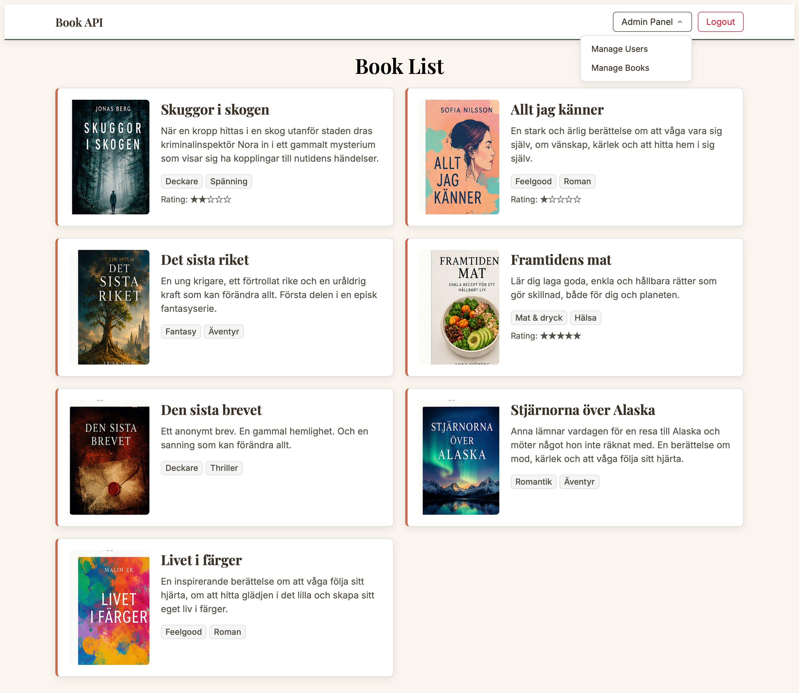
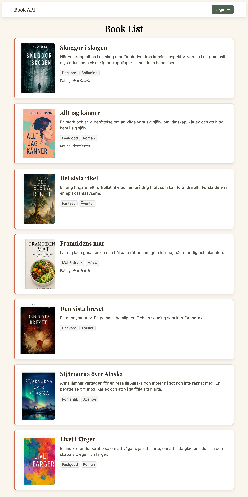
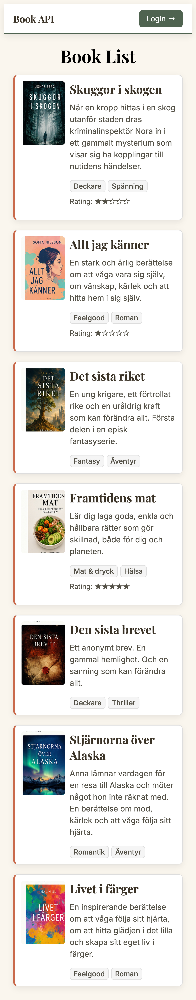
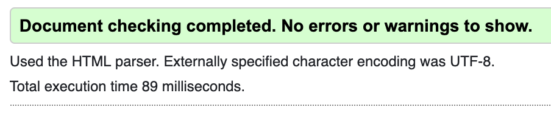
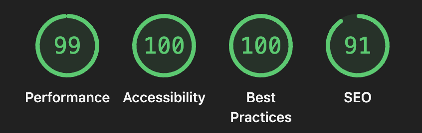
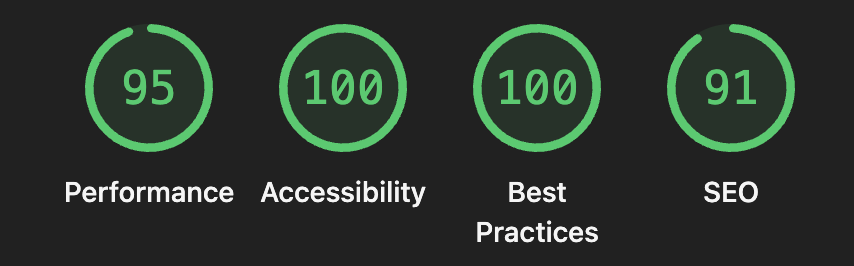

# Book API

## About the project

Book API is a school project built at Medieinstitutet, developed as a group assignment focused on API development and secure user handling. The project consists of a REST API backend built with Node.js, Express and TypeScript, connected to a MongoDB database, along with a client.

The team of three split the work into three areas of responsibility: user management and authentication (Isabelle), book management (Elena & Emil), and review management (Emil). Development covered secure user handling — including registration, login, session management via JWT stored in HTTP-only cookies, and role-based access control for an admin panel — alongside full CRUD functionality for books and reviews.

## Technologies

**💻 Development & Backend**

  	   

**🔐 Authentication & Security**

 

**🛠️ Tools & Quality**

 

**🚀 Version Control & Deployment**

**Developed by:**

[Elena Holmberg](https://github.com/elenaholmberg), 
 [Karl Emil Lychnell](https://github.com/elychnell),
[Isabelle Reynolds](https://github.com/isabelletherese)

## Features

- User registration and login with hashed passwords (bcrypt)
- Session handling via JWT stored in secure, HTTP-only cookies
- Role-based access control (admin vs. regular user)
- Admin panel for managing users, with edit and delete functionality
- Book management (CRUD), publicly readable, admin-only write access
- Review management (CRUD), publicly readable and postable, admin-only for editing and deleting
- Input sanitization to prevent XSS in the admin interface

## Screenshots

**Desktop**

**Tablet**

**Mobile**

## Accessibility: 

### W3C HTML Validator

### Lighthouse – desktop

### Lighthouse – mobile

## API Overview

**Auth**
| Method | Endpoint | Access |
|---|---|---|
| POST | `/api/auth/register` | Public |
| POST | `/api/auth/login` | Public |
| POST | `/api/auth/logout` | Public |
| GET | `/api/auth/status` | Public |

**Users**
| Method | Endpoint | Access |
|---|---|---|
| GET | `/api/users` | Admin |
| GET | `/api/users/:id` | Admin |
| PATCH | `/api/users/:id` | Admin |
| DELETE | `/api/users/:id` | Admin |

**Books**
| Method | Endpoint | Access |
|---|---|---|
| GET | `/api/books` | Public |
| GET | `/api/books/:id` | Public |
| POST | `/api/books` | Admin |
| PATCH | `/api/books/:id` | Admin |
| DELETE | `/api/books/:id` | Admin |

**Reviews**
| Method | Endpoint | Access |
|---|---|---|
| GET | `/api/reviews` | Public |
| GET | `/api/reviews/:id` | Public |
| POST | `/api/reviews` | Public |
| PATCH | `/api/reviews/:id` | Admin |
| DELETE | `/api/reviews/:id` | Admin |